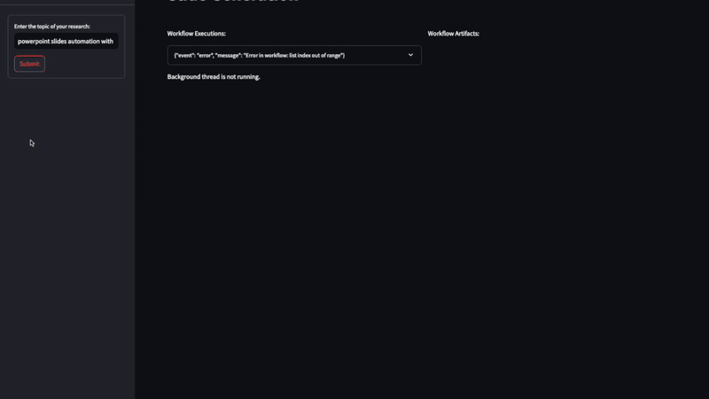

# ResearchFlow Agent

ResearchFlow Agent is an AI-assisted research workflow application for exploring papers, organizing findings, and generating presentation-ready slide material. It combines a FastAPI backend with a Streamlit frontend so research tasks can be run through an interactive interface while the workflow logic remains isolated in backend services.

The project is designed around a practical research flow: submit a research topic, collect and process relevant context, summarize findings, and turn the output into structured material for presentation. The backend contains prompts, LLM and embedding services, workflow definitions, configuration, and API endpoints. The frontend provides the user-facing pages for running the workflow and reviewing generated results.



## Project Structure

```
├── backend                     # Backend code using FastAPI
│   ├── prompts                 # Prompts used in the workflow 
│   ├── services                # Services for LLMs and embeddings
│   ├── utils                   # Utility functions
│   ├── workflows               # Workflow definitions
│   ├── config.py               # Configuration settings
│   ├── models.py               # Pydantic models
│   ├── main.py                 # Main entry point for FastAPI
│   ├── Dockerfile              # Dockerfile for backend
│   └── pyproject.toml          # Backend dependencies
│  
├── frontend                    # Frontend code using Streamlit
│   ├── pages                   # Streamlit pages
│   ├── Dockerfile              # Dockerfile for frontend
│   ├── pyproject.toml          # Frontend dependencies
└── └── app.py                  # Main entry point for Streamlit
```


## Prerequisites

- Python >= 3.12
- Poetry
- Docker
- Docker Compose


## Setup

1. **Clone the repository**:
   ```bash
   git clone <repository-url>
   cd <repository-directory>
   poetry install
   ```

2. **Set up environment variables**
    
    Create a `.env` file in the root directory,
    and add the following environment variables as those listed in `.env.example`


3. **Build and run the Docker containers**:
   ```bash
   docker-compose up --build
   ```

4. **Access the application**:
   - Frontend: Open your browser and go to `http://localhost:8501`
   - Backend: API documentation available at `http://localhost:8000/docs`
## Usage

- **Summary and Slide Generation**: Navigate to the "Slide Generation" page in the Streamlit app, enter the research topic query, and click the submit button to start the process.
